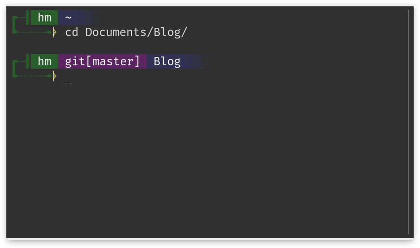

# Custom Bash Prompt PS1

Just copy [this](https://gitlab.com/habibmustofa/custom-bash-prompt-ps1/blob/master/hm-bash-prompt.sh) script to your **.bashrc** and reload your terminal.

You can change colors and unique character whatever you want!
